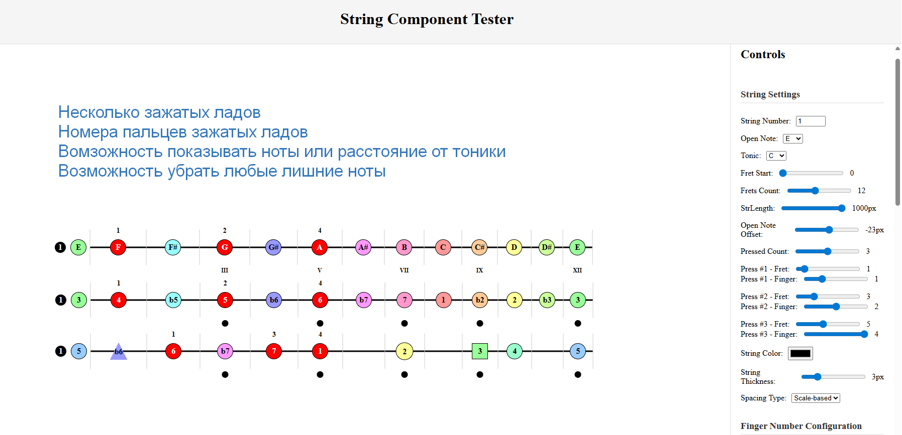

# String Component Tester

## Описание

String Component Tester — это интерактивное React-приложение для визуализации и настройки гитарной струны с различными параметрами отображения. Приложение позволяет экспериментировать с настройками струны, ладов, нот и меток, предоставляя богатые возможности кастомизации.


## Основные возможности

### Настройки струны
- **Номер струны**: выбор номера струны (1-6)
- **Длина струны**: регулировка длины от 300 до 1000 пикселей
- **Открытая нота**: выбор ноты открытой струны (C, C#, D, ..., B)
- **Смещение открытой ноты**: регулировка положения открытой ноты
- **Тоника**: установка тональности для расчета интервалов
- **Цвет и толщина струны**: настройка внешнего вида струны
- **Тип spacing**: фиксированный или основанный на масштабе

### Метки струн
- Показ/скрытие метки номера струны
- Настройка размера, формы и положения метки
- Выбор цвета фона и текста

### Конфигурация нот
- Настройка отображения для различных интервалов (по умолчанию, нажатый лад, все интервалы)
- Показ нот или интервалов
- Центрирование ноты в ладу
- Настройка размера, формы и цвета нот
- Конфигурация границ (цвет, размер)

### Метки ладов
- Показ/скрытие меток ладов
- Выбор конкретных ладов для отображения
- Формат номеров (арабские или римские цифры)
- Настройка положения, размера и цвета меток

## Установка и запуск

1. Клонируйте репозиторий
2. Установите зависимости:
```bash
npm install
```

3. Запустите приложение:
```bash
npm start
```

4. Откройте [http://localhost:3000](http://localhost:3000) в браузере

## Использование

### Основные элементы интерфейса

- **Левая панель**: Визуальное представление струны с текущими настройками
- **Правая панель**: Панель управления с группами настроек

### Взаимодействие

- Нажимайте на ноты на струне для их активации
- Используйте ползунки, селекторы и чекбоксы для изменения параметров
- Изменения применяются в реальном времени

### Особенности работы

- **Интервалы**: При изменении тональности автоматически пересчитываются интервалы для каждой ноты
- **Цветовая кодировка**: Разные интервалы могут иметь различную цветовую схему
- **Адаптивное отображение**: Все изменения мгновенно отражаются на визуализации

## Технологии

- React 18+
- CSS Modules для стилизации
- Функциональные компоненты и хуки

## Структура проекта

```
src/
  components/
    Controls/       # Панель управления
    String/         # Компонент струны
    Note/           # Компонент ноты
  App.jsx           # Основной компонент приложения
```

## Кастомизация

Приложение поддерживает глубокую кастомизацию через:
- Конфигурацию отдельных интервалов
- Настройку внешнего вида различных элементов
- Гибкую систему позиционирования
- Разнообразные формы отображения нот и меток

## Возможности расширения

- Добавление поддержки нескольких струн
- Реализация аккордовых форм
- Экспорт конфигураций
- Сохранение настроек
- Аудиовоспроизведение нот